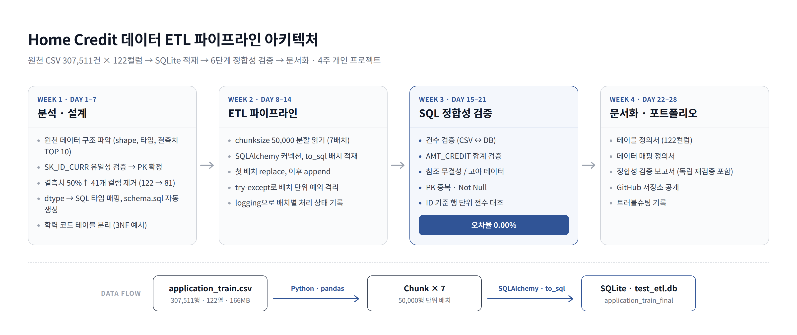
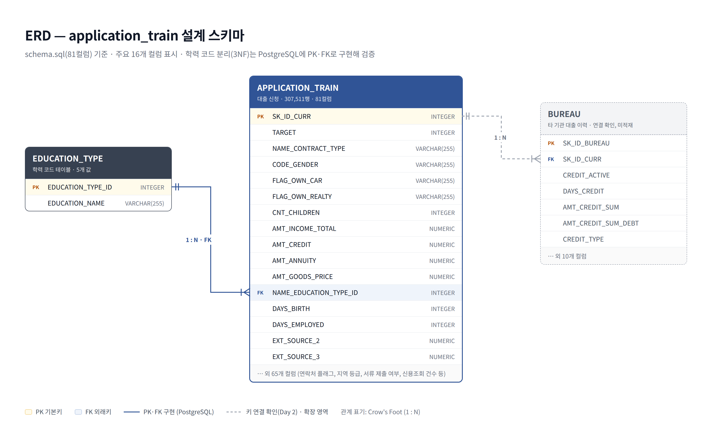
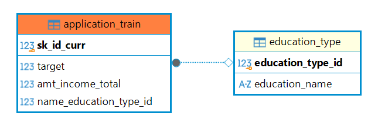

# 대용량 금융 데이터 ETL 파이프라인 구축 및 정합성 검증

30만 건 규모의 공공 금융 데이터를 대상으로 DB 설계 → ETL 파이프라인 구현 → SQL 정합성 검증 → 문서화까지 수행한 데이터 엔지니어링 개인 프로젝트입니다.

**핵심 성과: 307,511건 전수 대조 결과 오차율 0.00% 달성**

---

## 프로젝트 개요

| 항목 | 내용 |
|---|---|
| 원본 데이터 | Home Credit Default Risk (Kaggle) — `application_train.csv` |
| 데이터 규모 | 307,511건 × 122컬럼 (약 166MB) |
| 대상 DB | PostgreSQL (정규화 스키마 설계·검증), SQLite (`test_etl.db`, 대용량 적재) |
| 수행 기간 | 4주 (설계 1주 / ETL 1주 / 검증 1주 / 문서화 1주) |
| 사용 기술 | Python (pandas, SQLAlchemy), SQL, PostgreSQL, SQLite, DBeaver |

---

## 파이프라인 흐름



---

## 폴더 구조

```
.
├── sql/
│   ├── schema.sql               # 설계 단계에서 자동 생성한 DDL (PK 제약조건 포함)
│   ├── ddl_postgres.sql         # PostgreSQL 정규화 스키마 (PK·FK)
│   └── validation_queries.sql   # 정합성 검증에 사용한 SQL 쿼리 모음
├── src/
│   ├── 01_analysis/             # 1주차: 원천 데이터 분석 및 DB 설계
│   ├── 02_etl/                  # 2주차: ETL 파이프라인 구현
│   └── 03_validation/           # 3주차: SQL 정합성 검증
├── docs/                        # 4주차: 산출 문서 (엑셀) + 다이어그램(images/)
│   ├── 01_테이블_정의서.xlsx
│   ├── 02_데이터_매핑_정의서.xlsx
│   └── 03_정합성_검증_보고서.xlsx
├── captures/                    # 검증 실행 결과 스크린샷
└── requirements.txt
```

---

## 단계별 상세

### 1주차 — 원천 데이터 분석 및 DB 설계 (`src/01_analysis`)

| 파일 | 내용 |
|---|---|
| `day02_data_profiling.py` | 데이터 구조 파악(shape, 컬럼 목록, 결측치 TOP 10), 마스터키(SK_ID_CURR) 유일성 검증, `bureau.csv`와의 외래키 연결 가능성 확인 |
| `day03_full_cleaning.py` | 결측치 50% 이상 컬럼 41개 제거(122 → 81컬럼), 수치형은 중앙값·문자형은 `Unknown`으로 결측치 전량 처리 |
| `day04_generate_ddl.py` | 정제 데이터의 dtype을 SQL 타입으로 매핑해 `schema.sql` 자동 생성, 학력 컬럼을 코드 테이블로 분리하는 제3정규화 예시 구현 |
| `sql/ddl_postgres.sql` | PostgreSQL에 `education_type`(부모)·`application_train`(자식) 테이블을 PK·FK 제약조건으로 생성하고 DBeaver로 관계 확인 |

데이터 사전(`HomeCredit_columns_description.csv`)을 참조해 컬럼 의미를 확인했고, 마스터키 후보 컬럼의 중복 여부를 사전 검증한 뒤 PK로 확정했습니다.



> ERD는 `schema.sql`(81컬럼) 기준입니다. 학력 코드 테이블 분리는 PostgreSQL에 PK·FK로 구현해 검증했으며, `BUREAU`는 키 연결만 확인하고 적재하지 않은 확장 영역입니다.

실제 PostgreSQL에 생성한 테이블 관계 (DBeaver 엔티티 관계도):



### 2주차 — ETL 파이프라인 구현 (`src/02_etl`)

| 파일 | 내용 |
|---|---|
| `day08_chunk_read.py` | 대용량 파일을 메모리에 한 번에 올리지 않도록 chunk 단위 분할 읽기 테스트 |
| `day09_clean_sample.py` | 정제 로직(결측치 채움, 공백 제거, 파생 컬럼 생성) 샘플 검증 |
| `day10_mapping_sample.py` | 범주형 값 매핑 로직(Y/N → 1/0) 샘플 검증 |
| `day11_load_test.py` | SQLAlchemy 커넥션 연결 및 소량 데이터 적재 테스트 |
| `day12_batch_load.py` | 5만 건 단위 배치 적재로 30만 건 전체 이관, 소요 시간 측정 |
| `day13_error_handling.py` | `try-except` 기반 예외 격리 — 특정 배치 실패 시에도 파이프라인 전체가 중단되지 않도록 처리, `logging`으로 배치별 상태 기록 |
| `day14_final_etl.py` | 최종 ETL 파이프라인 (배치 적재 + 예외 처리 + 로깅 통합) |

메모리 한계를 고려해 전체를 한 번에 읽지 않고 5만 건씩 나누어 처리했으며, 첫 배치는 `replace`, 이후 배치는 `append` 모드로 적재했습니다.

### 3주차 — SQL 정합성 검증 (`src/03_validation`)

| 파일 | 검증 항목 |
|---|---|
| `day15_count_validation.py` | 원본 CSV 건수 vs DB 적재 건수 |
| `day16_sum_validation.py` | `AMT_CREDIT` 총합 대조 (부동소수점 오차 방지를 위한 반올림 처리) |
| `day17_fk_validation.py` | 참조 무결성 / 고아 데이터 존재 여부 |
| `day18_pk_null_validation.py` | PK 중복 및 필수 컬럼 누락 여부 |
| `day19_troubleshooting.py` | 원본-DB를 ID 기준 1:1 병합해 값 단위까지 전수 대조 |

### 4주차 — 문서화 (`docs`)

| 문서 | 내용 |
|---|---|
| `01_테이블_정의서.xlsx` | 122개 컬럼의 데이터 타입, PK 여부, 결측치 건수·비율, 컬럼 설명 |
| `02_데이터_매핑_정의서.xlsx` | 원천 컬럼 → DB 컬럼 변환 규칙 및 적용 여부 |
| `03_정합성_검증_보고서.xlsx` | 6개 검증 항목의 결과 및 오차율 증빙 |

---

## 검증 결과

| 검증 항목 | 원본 | DB | 오차 |
|---|---|---|---|
| 건수 | 307,511건 | 307,511건 | 0건 (0.00%) |
| 합계 (AMT_CREDIT) | 184,207,084,195.50 | 184,207,084,195.50 | 0 (0.00%) |
| 참조 무결성 위반 | — | 0건 | 0건 |
| PK 중복 | — | 0건 | 0건 |
| 필수값 누락 | — | 0건 | 0건 |
| 행 단위 전수 대조 | 307,511건 | 307,511건 | 불일치 0건 |

집계 검증만으로는 두 레코드의 값이 서로 뒤바뀐 경우를 잡을 수 없기 때문에, 마지막에 ID 기준 1:1 병합으로 값 단위까지 전수 대조하여 최종 확인했습니다.

---

## 트러블슈팅 및 회고

**1. 대용량 파일의 메모리 문제**
30만 건 전체를 한 번에 읽으면 메모리 부담이 크기 때문에, `chunksize`를 활용한 분할 처리로 전환했습니다. 검증 단계에서도 필요한 컬럼만 `usecols`로 선택해 읽어 불필요한 메모리 사용을 줄였습니다.

**2. 부동소수점 합계 불일치 가능성**
Python과 SQLite의 부동소수점 연산 방식 차이로 합계가 미세하게 어긋날 수 있어, 양쪽 모두 소수점 2자리로 반올림한 뒤 비교하도록 처리했습니다.

**3. 설계 산출물과 실제 구현의 불일치 (가장 큰 배움)**
설계 단계(`day03`, `day04`)에서는 결측치 50% 이상 컬럼을 제거한 정제본(81컬럼)과 PK 제약조건이 포함된 `schema.sql`을 만들었지만, ETL 구현 단계(`day08` 이후)에서는 정제본이 아닌 **원본 CSV(122컬럼)를 다시 읽어 적재**하는 방식으로 전환되었습니다. 그 결과 최종 DB는 설계한 스키마를 반영하지 않은 상태가 되었습니다.

문서화 단계에서 실제 DB 스키마를 직접 조회(`PRAGMA table_info`)하며 이 차이를 발견했고, 설계와 구현 사이의 정합성 역시 데이터 정합성만큼 관리 대상이라는 점을 배웠습니다. 개선한다면 ETL의 입력을 정제본으로 고정하고, `schema.sql`로 테이블을 먼저 생성한 뒤 적재하도록 순서를 바로잡아야 합니다.

**4. 미처리 상태로 남은 이상치**
`DAYS_EMPLOYED` 컬럼에 실제 근속일수로 해석할 수 없는 값 `365243`이 55,374건(전체의 약 18%) 존재합니다. 무직·연금수급자를 표시하기 위한 대체값으로 추정되며, 현재 파이프라인에는 이를 처리하는 로직이 없습니다. 처리 방식(결측 처리 / 별도 플래그 컬럼 생성)은 데이터 활용 목적에 따라 달라지므로, 문서에 현황을 기록하는 것까지 수행했습니다.

---

## 실행 방법

```bash
pip install -r requirements.txt

# 1. 원천 데이터 분석 및 정제
python src/01_analysis/day02_data_profiling.py
python src/01_analysis/day03_full_cleaning.py
python src/01_analysis/day04_generate_ddl.py

# 2. ETL 파이프라인 실행
python src/02_etl/day14_final_etl.py

# 3. 정합성 검증
python src/03_validation/day15_count_validation.py
python src/03_validation/day16_sum_validation.py
python src/03_validation/day17_fk_validation.py
python src/03_validation/day18_pk_null_validation.py
python src/03_validation/day19_troubleshooting.py
```

> 원본 데이터(`application_train.csv`)와 생성된 DB(`test_etl.db`)는 용량 문제로 저장소에 포함하지 않았습니다.
> 원본 데이터는 [Kaggle - Home Credit Default Risk](https://www.kaggle.com/competitions/home-credit-default-risk/data)에서 받을 수 있으며, 스크립트 내 파일 경로를 환경에 맞게 수정한 뒤 실행하면 됩니다.
